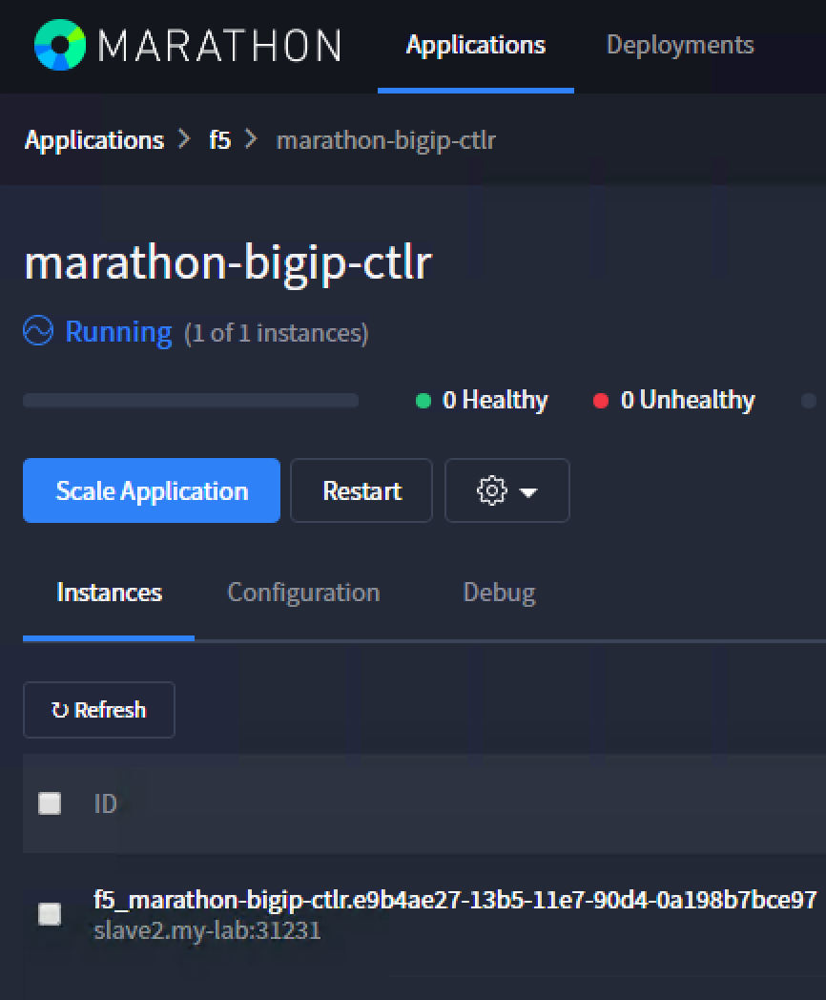
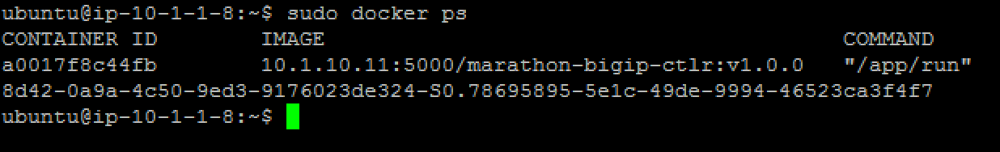
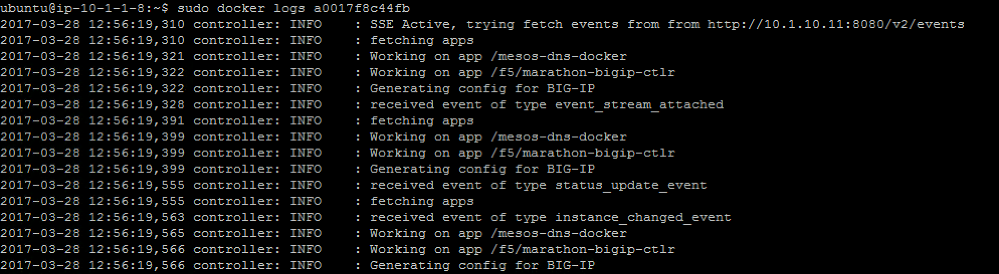
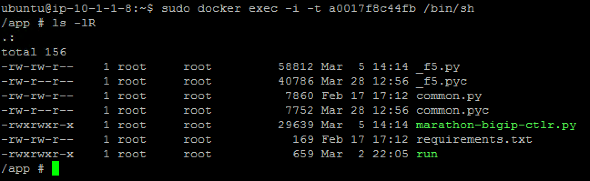

Container Connector(CC) Setup
=============================

the official Container Connector documentation is here: `Install the F5 Marathon BIG-IP Controller <http://clouddocs.f5.com/containers/v1/marathon/mctlr-app-install.html>`_

In a Mesos / Marathon environment, the name of the product is Marathon BIG-IP controller. 

BIG-IP setup
------------

To use F5 Container connector / Marathon BIG-IP Controller, you'll need a BIG-IP up and running first. 

In the UDF blueprint, you should have a BIG-IP available at the following URL: https://10.1.10.60. 

.. warning:: 

  if you use UDF, it's recommended to connect to your BIG-IP from the RDP session instead of going directly to it from the UDF portal and TMUI option

Connect to your BIG-IP and check it is active and licensed. Its login and password are: **admin/admin**

.. note::

  if your BIG-IP has no license or its license expired, renew the license. You just need a LTM VE license for this lab. No specific add-ons are required

You need to setup a partition that will be used by F5 Container Connector. 

To do so, go to : System > Users > Partition List. Create a new partition called "mesos"

.. image:: ../images/f5-container-connector-bigip-partition-setup.png
  :align: center
  :scale: 50%

Once your partition is created, we can go back to the Marathon interface 

Marathon BIG-IP Controller installation
---------------------------------------

Here we consider you have already retrieved the F5 container connector image and loaded it in the environment. **If you use the UDF blueprint it's already loaded in our private registry 10.1.10.11:5000 (10.1.10.11:5000/marathon-bigip-ctlr:v1.0.0)**.

If you haven't loaded it in your environment, you have two choices :

#. load it on **all your agents/slaves** with the docker load -i <file_name.tar> 
#. load it on a system and push it into your registry

To deploy our Marathon BIG-IP Controller, we need to either use Marathon UI or use the Marathon REST API. 

* Connect to the Marathon UI on `http://10.1.10.11:8080 <http://10.1.10.11:8080>`_ and click on "Create Application".
* Click on "JSON mode"

.. Note:: 

  If you use the UDF blueprint, Chrome in the Jumpbox has a bookmark to access Marathon. 

Use the following JSON config

::

  {
    "id": "f5/marathon-bigip-ctlr",
    "cpus": 0.5,
    "mem": 64.0,
    "instances": 1,
    "container": {
      "type": "DOCKER",
      "docker": {
        "image": "f5networks/marathon-bigip-ctlr:1.0.0",
        "network": "BRIDGE"
      }
    },
    "env": {
      "MARATHON_URL": "http://10.1.10.11:8080",
  		"F5_CC_PARTITIONS": "mesos",
      "F5_CC_BIGIP_HOSTNAME": "10.1.10.60",
      "F5_CC_BIGIP_USERNAME": "admin",
      "F5_CC_BIGIP_PASSWORD": "admin"
    }
  }

.. note::

	* If you don't use the UDF blueprint, you need to update the field *image* with the appropriate path to your image. 
	* If your Mesos environment use authentication , here is a link explaining how to handle authentication with the Marathon BIG-IP Controller: `Set up authentication to your secure DC/OS cluster <http://clouddocs.f5.com/containers/v1/marathon/mctlr-authenticate-dcos.html#mesos-authentication>`_

Troubleshooting
---------------

If you need to check the Marathon BIG-IP Controller you can do the following: 

#. Check the logs
#. Connect to the container

To check the logs, you need to identify where is the Controller running. In Marathon UI: 

#. Click on Applications
#. Click on the f5 folder
#. Click on marathon-bigip-ctlr 

you should see something like this : 

Here we can see that the Controller is running on slave2. Connect via SSH to **slave2** and run the following commands

.. code-block:: none

  sudo docker ps 

This command will give us the ID of our Controller container ID, here it is : a0017f8c44fb. We need this ID for the next few commands

To check the logs of our Controller: 

.. code-block:: none

  sudo docker logs a0017f8c44fb

To connect to our container with a Shell: 

.. code-block:: none

   sudo docker exec -i -t a0017f8c44fb /bin/sh

