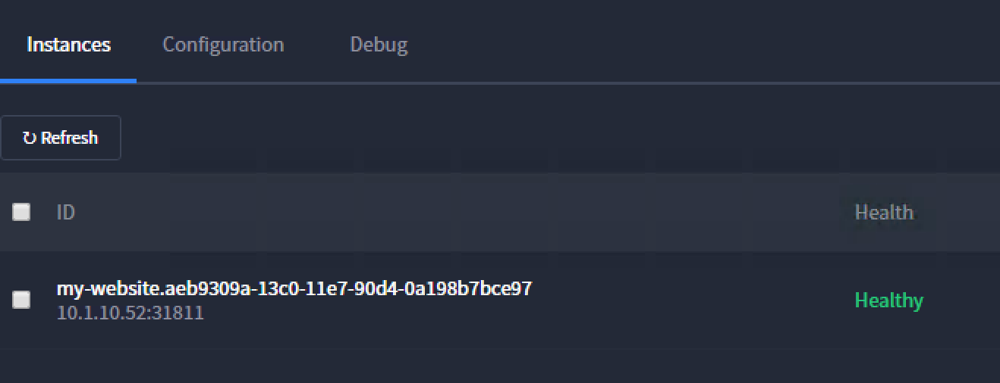
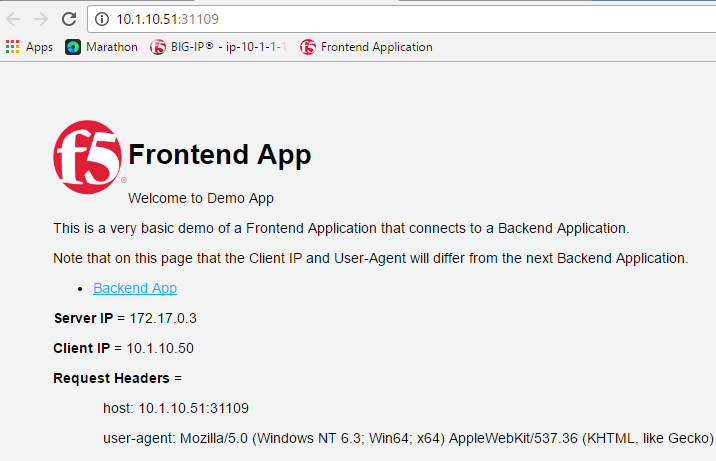
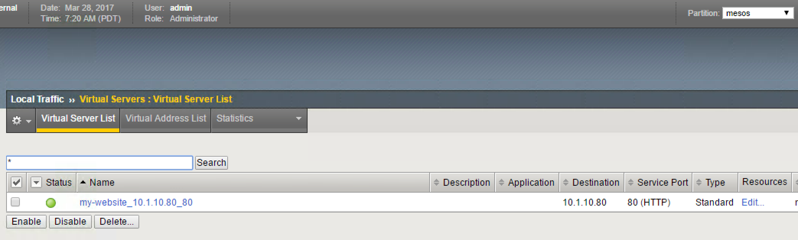
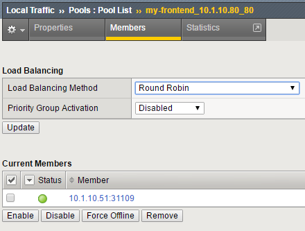
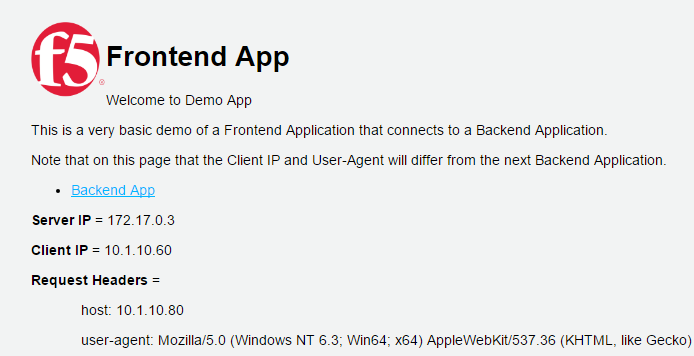
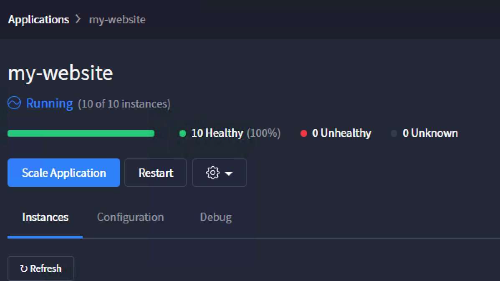
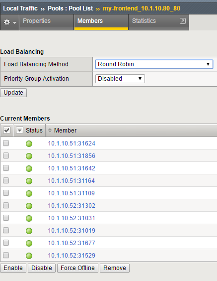

Container Connector - Marathon BIG-IP Controller Usage
======================================================

Now that our container connector (Marathon BIG-IP Controller) is up and running, let's deploy an application and leverage our BIG-IP Controller. 

if you don't use UDF, you can deploy any application you want. In UDF, the blueprint has a container called f5-demo-app already loaded as an image (Application provided by Eric Chen - F5 Cloud SA). It is loaded in our container registry 10.1.10.11:5000/f5-demo-app

Frontend application deployment
-------------------------------

To deploy our front-end application, we will need to do the following:

#. Go to Marathon UI and click on "Create application"
#. Click on "JSON Mode"

.. _frontend_definition:

::

	{
		"id": "my-frontend",
		"cpus": 0.1,
		"mem": 128.0,
		"container": {
			"type": "DOCKER",
			"docker": {
				"image": "10.1.10.11:5000/f5-demo-app",
				"network": "BRIDGE",
				"portMappings": [
					{ "containerPort": 80, "hostPort": 0, "protocol": "tcp" }
				]
			}
		},
		"labels": {
			"F5_PARTITION": "mesos",
			"F5_0_BIND_ADDR": "10.1.10.80",
			"F5_0_MODE": "http",
			"F5_0_PORT": "80",
			"run": "my-frontend"
		},
		"env": {
		"F5DEMO_APP": "frontend",
		"F5DEMO_BACKEND_URL": "http://asp-my-backend:31899/"
		},
		"healthChecks": [
		{
			"protocol": "HTTP",
			"portIndex": 0,
			"path": "/",
			"gracePeriodSeconds": 5,
			"intervalSeconds": 20,
			"maxConsecutiveFailures": 3
		}
		]
	}

#. Click on "Create Application"

.. note::

	Here we specified a few things: 
	#. The involved BIG-IP configuration (Partition, VS IP, VS Port)
	#. The Marathon health check for this app. The BIG-IP will replicate those health checks 
	#. We didn't specified how many instances of this application we want so it will deploy a single instance

Here wait for your application to be successfully deployed and be in a running state. 

Click on "My Website". Here you will see the instance deployed and how to access it (here it's 10.1.10.52:31811 - you may have something else)

Click on the <IP:Port> assigned to be redirect there: 

We can check whether the Marathon BIG-IP Controller has updated our BIG-IP configuration accordingly

Connect to your BIG-IP on https://10.1.10.60 and go to Local Traffic > Virtual Server. Select the Partition called "Mesos". You should have something like this: 

Go to Local Traffic > Pool > "my-website_10.1.10.80_80" > Members. Here we can see that a single pool member is defined. 

In your browser try to connecto to http://10.1.10.80. You should be able to access the application:

.. note::

	if you try to click on the link "Backend App", it will fail. This is expected

Scale the application via Marathon
----------------------------------

We can try to increase the number of containers delivering our application. To do so , go back to the Marathon UI (http://10.1.10.11:8080). Go to Applications > my Website  and click on "Scale Application". Let's request 10 instances. Click on "Scale Application". 

Once it is done, you should see 10 "healthy instances" running in Marathon UI. You can also check your pool members list on your BIG-IP. 

.. image:: ../images/f5-container-connector-scale-application-UI.png
	:align: center
	:scale: 50%

As we can see, the Marathon BIG-IP Controller is adapting the pool members setup based on the number of instances delivering this application automatically. 

Scale back the application to 1 to save ressources for the next labs