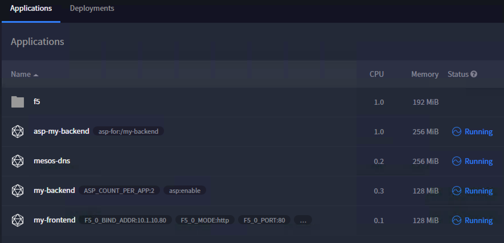

Automated Deployment
====================

**This section is only valid if you use the UDF Blueprint**

.. warning::

	You still need to license your BIG-IP before doing this section!

In some situation, you may not want to setup everything yourself. You may want to: 

	* Do a quick demo
	* Test something
	* Do some troubleshooting

In this case, you have the option to deploy everything automatically. 

On the Desktop of the Jumpbox, you have two different batch scripts: 

	* Automatic-deployment-f5-demo.bat
	* Delete-f5-demo.bat

Those two files will call a POSTMAN collection via newman to process it automatically. 

.. image:: ../images/your-lab-automated-deployment-scripts.png
	:align: center
	:scale: 50%

Automatic-deployment-f5-demo.bat will do the following: 

	1. Setup the mesos partition on the BIG-IP
	2. Deploy the F5 container connector
	3. Deploy a frontend application that will push some configuration on the F5 BIG-IP
	4. Deploy the F5 ASP controller for Marathon
	5. Deploy a backend application that will be fronted by ASP. 

Delete-f5-demo will simply remove everything that was done previously

If you want to check that everything has been deployed successfully, you can simply connect to the Marathon UI to see if everything is in a running state: http://10.1.10.11:8080

.. note::

	It takes some time for mesos-dns to be updated with your ASP information. So you may have some issues at first when you click on the "backend link" on the frontend web page (10.1.10.80). Wait a little if you see the following page before retrying

	.. image:: ../images/your-lab-automated-deployment-dns-error.png
		:align: center
		:scale: 50%

